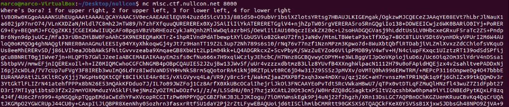

# nullcon HackIM 2020 - Dora
## Netcat / Image recognition

Dora was a challenge at nullcon [HackIM 2020 CTF Event](https://ctf.nullcon.net/). Essentially the instructions just told to 

~~~bash
nc misc.ctf.nullcon.net 8000
~~~

Also there was a hint that we have to find Dora 800 times

When we initiated the connection for the first time, this is what we got:

* A short instruction that we have to respond with 1-4, depending in which sector of the picture Dora is
* A big base64 string

If we put the string into [CyberChef](https://gchq.github.io/CyberChef/) and hit the Wizard button, we see that it's a base64 encoded raw png image:

The girl is Dora, and we have to determine in which sector of the picture she is. 

If your answer is wrong, you will be disconnected and need to start from scratch. 

Since we need to repeat this 800 times to get the flag, it's clear that we need to automate it. Also there was a remark on the discord channel of people complaining to get disconnected after 30min. 1800 seconds for 800 pictures leave us with 2,25 sec / picture. 

So the requirements are:
* it has to work fully automatic
* it has to work reliable
* it has to work fast and efficient (2,25sec / picture max)

Basic flowchart:

Decission was quickly made to implement this in python. First we need the basic functionality to establish the connection and send + receive data. I've never done something like this before, but luckily there was help on the internet. After a lot of research I finally learned how to use python sockets to reliably send and receive data. I will provide the full code at the bottom of this writeup. Since these type of nc challenges are quite popular, this basic framework definetly will go into my stash for many more CTFs to come :)

Once the part with the interactive session was working, we only need base64.b64decode() the received data and write it into the .png file. 

Now the really tricky part of this challenge was how to reliably identify where Dora was. The pictures we receive seem to be auto-generated with some sort of randomizer:

* background color changes
* there are multiple versions of Dora
* sometimes she was mirrored
* the distractive characters always seems to be the same
* size of the complete picture is always 720x720
* sizes of all characters in the picture will vary

After some further research I found that OpenCV has an interesting Template Matching API which can be perfectly used for our case:
See tutorial and explanation here: https://opencv-python-tutroals.readthedocs.io/en/latest/py_tutorials/py_imgproc/py_template_matching/py_template_matching.html

This seems to be just perfect. We give a picture an a template (which is the smaller picture to look up in the big picture), and as result we get X and Y coordinates. 

Those can be translated to the sectors

~~~python
if (y < 342):
  if (x >= 342):
    return 1
  else:
    return 2
else:
  if (x >= 342):
    return 4
  else:
    return 3
~~~

However we need to have a strategy to get reliable results. 

So the first attempt was that I used one template with Doras face and let it run. But that didn't really work since already after a few pictures, the algorithm identified the ape instead of Dora and replied the wrong sector. So the connection was disrupted. 

My first thought whas that maybe there is simply too many different Dora-Versions to make the algorithm work reliably:

What if instead I try to mark the distractive characters and erase them from the picture by drawing a black or white box over them (depending on the selected comparision method, see link above. Best match area will either get black or white). So I created on template for each of the 5 distractions and in a first step, erased them. Then I also grayscaled the picture to remove the influence of the color as good as possible, and finally looked up for Dora in the remaining picture.  

Basically it worked, but the success rate was if at all, just a little bit better then with the first approach. 

Main problem was that sometimes also the distractions couldn't be idenfied reliably. Sometimes Dora was recognized as ape and overwritten by a box. Then when in the second step the algorithm looked for Dora, it just found the ape ...

So we still need optimize further.

One more step was to instead of just grayscale, I switched to "edge detection", which is also possible via OpenCV:
https://docs.opencv.org/trunk/da/d22/tutorial_py_canny.html

But still not sufficient. Whatever I did to tweak things, I always got disconnected after just a few dozend successfull pictures. 

So the thought arose that I need to implement this in a way that it can improve and learn from failures.

The key finally was to consider the confidence value which was also returned by the template matching. Don't just look for one version of dora (or one version of the distractive characters), look at multiple templates instead and go for the one whith the highest confidence. With this idea in mind I changed back to just search Dora. And whenever the algorithm lead to wrong answer, I would go back at the edged image and copy the Dora version from there into my template collection. So next time a similar picture is transmited, my algorithm would be able to identify this Dora with a high confidence. 

Basic flowchart:

The problem really was that the same Dora could be "edged" very differently, depending on her size and the background color which was used. 

So finally I ended up with a collection of 44 different doras:

For each received picture I had to iterate trough all of them, which costed a lot of CPU. I noticed that on my Virtualbox Linux which I usualy use for CTF (I know, I'm terribly paranoid ... ), this became a problem because of the 30 min timeout -> 2,25sec / picture limit. So I had to do this from a bare metal linux laptop which I luckily had at hand (preparation is everything! :P)

Also the server with which I'm comunicating was in India and had a ping of about 250ms. 

Since I was adding more and more pictures to the collection, the runtime for the comparision increased, the better the algorithm became. 

In order to keep an eye on this I started to take notes at how long it took to process so and so many pictures. Also these notes showed nicely how my algorithm improved, since with a growing template collection it managed to answer more and more pictures corretly:

Y: failed at picture
X: number of templates in collection

With ~40 pictures in the db it started to become really stable, and finally with 44 I was able to receive picture number 801, which contained the flag,  after 26min! 

**Important remark:** Ensure to catpure whatever comes after the 800 pictures. You wouldn't be the first one to solve the challenge, but miss the flag :P

And because I'm so proud of what I've created here is a [video of the execution](attachments/Screencast-dora.webm)

and the code
~~~python
#!/usr/bin/env python3

#import subprocess
import socket
import base64
import time
from datetime import datetime
import cv2
import numpy as np
from matplotlib import pyplot as plt

BUFSIZE = 1024
DEBUG = True
start = time.time()
method = 'cv2.TM_CCOEFF'
		#  max_loc = top left coordinate for methods 'cv2.TM_CCOEFF', 'cv2.TM_CCOEFF_NORMED', 'cv2.TM_CCORR', 'cv2.TM_CCORR_NORMED'
		#  min_loc = top left coordinate for methods 'cv2.TM_SQDIFF' and 'cv2.TM_SQDIFF_NORMED'
		#  see https://opencv-python-tutroals.readthedocs.io/en/latest/py_tutorials/py_imgproc/py_template_matching/py_template_matching.html

def readuntil(s,val):
	buf = b''
	while not buf.endswith(val):
		ret = s.recv(BUFSIZE)
		buf = buf + ret
		if len(ret) == 0:
			break
			#raise Exception('received zero bytes')
	if DEBUG:
		print('RECV: ', buf[:100], '[...]')
	return buf

def sendall(s,buf):
	if DEBUG:
		print('SND: ', buf)
	n = s.send(buf)

# Prepare socket connection to CTF netcat
s = socket.socket(socket.AF_INET, socket.SOCK_STREAM)
s.setsockopt(socket.IPPROTO_TCP, socket.TCP_NODELAY, 1)
s.connect(('misc.ctf.nullcon.net',8000))

# Read "Welcome Banner"
# "Where's Dora? 1 for upper right, 2 for upper left, 3 for lower left, 4 for lower right"
readuntil(s, b'\n').decode('ascii')

sum_conf=0	# sum of confidence
i=0		# number of current image
while True:
	data = readuntil(s, b'\n').decode('ascii')
	if len(data)>40000:
		# out_<starttime>_<integer>.png
		img_name = 'loot/out_' + str(start) + '_' + str(i).zfill(4) + '.png'	
		# out_<starttime>_<integer>_edge.png	
		img_name_edge = 'loot/out_' + str(start) + '_' + str(i).zfill(4) + '_edge.png'		

		# write image to file
		with open(img_name, 'wb') as output_file:		
			output_file.write(base64.b64decode(data))	
			output_file.close()
		i = i + 1		# increment image counter
		
		
		# load image for analysis
		img = cv2.imread(img_name,0)

		# Edge detection
		CANNY_THRESH_1 = 1
		CANNY_THRESH_2 = 10
#		img = cv2.cvtColor(img,cv2.COLOR_BGR2GRAY)
		img = cv2.Canny(img, CANNY_THRESH_1, CANNY_THRESH_2)
		img = cv2.dilate(img, None)
		img = cv2.erode(img, None)
		cv2.imwrite(img_name_edge, img)
		doras = ['dora_1.png','dora_2.png','dora_3.png','dora_4.png','dora_5.png','dora_6.png','dora_7.png',
			'dora_8.png','dora_9.png','dora_10.png','dora_11.png','dora_12.png','dora_13.png','dora_14.png', 
			'dora_15.png','dora_16.png','dora_17.png','dora_18.png','dora_19.png','dora_20.png', 
			'dora_21.png','dora_22.png','dora_23.png','dora_24.png','dora_25.png','dora_26.png', 
			'dora_27.png','dora_28.png','dora_29.png','dora_30.png','dora_31.png','dora_32.png', 
			'dora_33.png','dora_34.png','dora_35.png','dora_36.png','dora_37.png','dora_38.png',
			'dora_39.png','dora_40.png','dora_41.png','dora_42.png','dora_43.png','dora_44.png']
		compares = []
		for dora in doras:
			# Prepare dora template for pattern search
			doraimg = cv2.imread(dora,0)

			# analyze image to find best matching dora dora
			res = cv2.matchTemplate(img, doraimg, eval(method))
			min_val, max_val, min_loc, max_loc = cv2.minMaxLoc(res)
			w, h = doraimg.shape[::-1]
			if method in ['cv2.TM_SQDIFF', 'cv2.TM_SQDIFF_NORMED']:
				dora_x = min_loc[0]
				dora_y = min_loc[1]
				confidence = min_val
			else:
				dora_x = max_loc[0]
				dora_y = max_loc[1]
				confidence = max_val
		
			#print(" >> " + dora + " Confidence level: " + str(confidence))
			dora_h = h
			dora_w = w	
			compares.append([confidence,dora,dora_x,dora_y,dora_w,dora_h])	
		
		conf_max = float(0.0)
		dora_n = ""
		dora_x = 0
		dora_y = 0
		#dora_h = 0
		#dora_w = 0
		for c in compares:
			if  conf_max < c[0]:
				conf_max = c[0]
				#print('  >>> ' + str(conf_max) + ' < ' + str(c[0]))
				dora_n = c[1]
				dora_x = c[2]
				dora_y = c[3]	
				#dora_w = c[4]
				#dora_h = c[5]
		print(img_name + ': Best match "' + dora_n+ '" at X: ' + str(dora_x) + ' Y: ' + str(dora_y ) + 
		' with confidence: ' + str(conf_max)) 
		sum_conf = sum_conf + conf_max

		#if (dora_y + (dora_h/2) < 335):
		if (dora_y < 330):
			#if (dora_x + (dora_w/2) >= 342):
			if (dora_x >= 342):
				sendall(s,str.encode('1\n'))
			else: 
				sendall(s,str.encode('2\n'))
		else:
			#if (dora_x + (dora_w/2) >= 342):
			if (dora_x >= 342):
				sendall(s,str.encode('4\n'))
			else: 
				sendall(s,str.encode('3\n'))
	else:
		break
print("Average convidence: " + str(sum_conf / i))
s.close()
~~~

**Remark in retrospective:** after sleeping over this, I now remember reading about face recognition in python one day. Surprisingly this is also possible with OpenCV, but there are also [others](https://github.com/ageitgey/face_recognition). So probably my way with plain image comparision was not the most efficient, but still I learned a lot and enjoyed this challenge very much! Although I spend way more time on this as expected ... 

